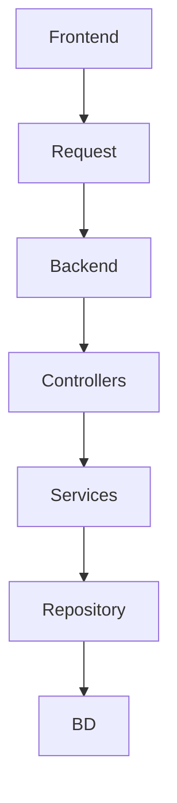
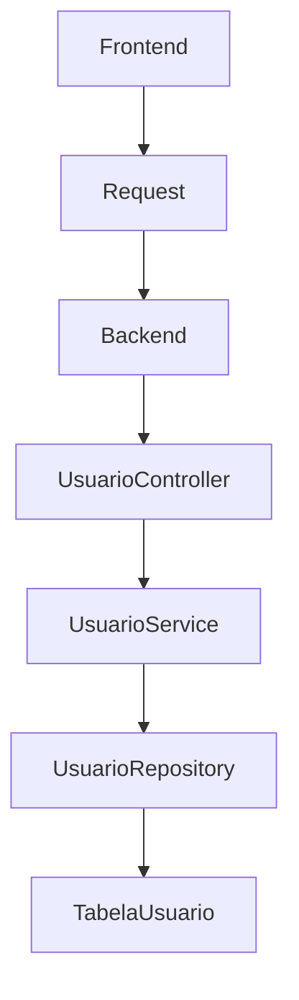

**MONOLYTHIC DEFAULT STRUCTURE**

```mermaid
graph TD;
    Frontend-->Request-->Backend-->Controllers;
    Controllers-->Services;
    Services-->Repository;
    Repository-->BD
```
**MONOLYTHIC STRUCTURE EXAMPLE**

```mermaid
graph TD;
    Frontend-->Request-->Backend-->UsuarioController;
    UsuarioController-->UsuarioService;
    UsuarioService-->UsuarioRepository;
    UsuarioRepository-->TabelaUsuario
```